# Exams

## ME 2024/2025

### 1.

The given HTML document (attachment) with accompanying resources (images, font) is not allowed to be changed.
It is necessary to create a junkfood.css file with which you should achieve the required (responsive) appearance from the initial appearance:

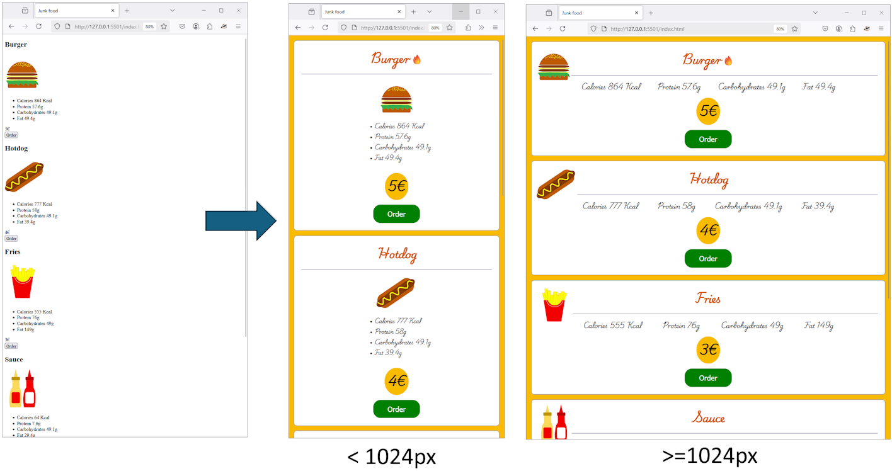

A zip file is attached containing:

- index.html which must not be changed
- images
- font that must be used

As a solution to the task, you only submit the content of the file junkfood.css.

The layout of the elements changes at 1024px, and all other parameters can be estimated from the image, with a couple of notes:

- the 🔥 character does not appear in HTML, but must be added via CSS to those elements that have the data-new attribute (see index.html)
- the line below the title also does not appear in HTML
- when the mouse is over the "Order" button, the color of the button is darker, see the video demo.mp4 
- colors:
  - #d35400 - heading
  - #f9bb00 - yellow background
  - navy - border below the title
  - green and darkgreen - "Order" button
- estimate the size of the fonts and the spacing and set them to be approximately equal to those in the image

Help:
- let's remember the comments from the lecture: "absolute is positioned with respect to the closest positioned ancestor, otherwise relative to body"

### 2.

Create an application that will allow to play a memory game with 16 cards arranged in 4 rows and 4 columns. The cards are labeled with the letters A–D and the numbers 1–4, and are initially arranged randomly (each of these eight symbols appears twice).

The image shows how the game should look (it doesn't have to be exactly the same):

- 4x4 cards
- top left is the score (Score), points are calculated as follows:
  - hit +50
  - miss -10
- top right is the timer (Time)
  - counts down from 60 to 0, ie the game lasts one minute

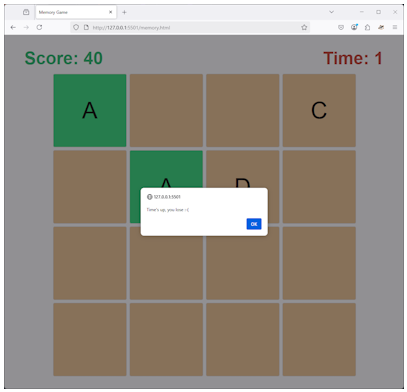

See the attached videos (win.mp4 and lose.mp4) for a demonstration of how the game should look, and here we emphasize:

- in one move, the player guesses a pair by clicking on the cards:
  - if a card pair is matching, the cards remain open and the background is changed to green
  - if they do not match, the cards remain open until the player starts the next move (by clicking on the card)
  - after each move it is necessary to update the score (+50/-10)
  - when guessing (clicking) disable clicking on already revealed cards (green cards or the first card when guessing a pair)
- it is necessary to update the time every second
- the game stops in one of two cases:
  - the player matched all pairs before the time ran out - report (alert) "You won !!!"
  - time (minute) ran out - alert "Time's up, you lose :-("
- after the game is over "reveal" all cards (in case of victory they will be already be revealed)

You need to submit:

1. write a comment in the text field what was done and what was not
2. as an attachment (upload) submit memory.zip consisting of:
- memory.html
- memory.css
- memory.js

Help:

- you can determine the initial random order of cards by putting all elements in an array and then swapping two randomly selected elements of the array N times
- you can use this CSS code (that you should store in memory.css) and build upon it:

```css
/* counter and timer style: */
#score {
    color: #27ae60;
    font-size: 3rem;
}
#timer {
    color: #c0392b;
    font-size: 3rem;
}
/* layout of one card: */
.card {
    width: 200px;
    height: 200px;
    position: relative;
    cursor: pointer;
    background-color: burlywood;
    border: 1px solid #ccc;
    border-radius: 5px;
    text-align: center;
    align-content: center;
}
/* with this we can disable clicking on paired cards: */
.matched {
    pointer-events: none;
}
```

---

## ME 2023/2024

### 1.

An HTML document (attached) with accompanying resources (images, font) is given. In this task, it is necessary to make changes within the <style> tag in order to change the initial appearance of the card:

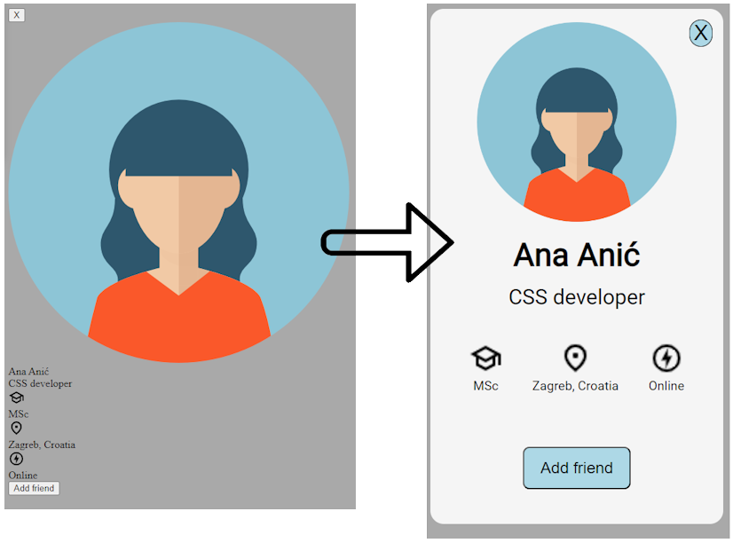

The card must be exactly 400px wide, while all other parameters are to be estimated from the image, with a few notes:

- the background shade of both blue buttons is called lightblue, and the card background is whitesmoke
- the button for closing the tab is on the top right, notice its relation to the image
- you must use the font from the given file
- notice:
  - different font sizes
  - alignment of text and elements
  - empty space between elements
  - round edges of the card and both buttons

As a solution to the task, submit only the <style> element with its contents.

### 2.

Create an application that enables a puzzle game with nine elements placed in three rows and three columns. The elements are numbered 1-9 and are initially randomly distributed. For the sake of simplicity, attached is the initial HTML file 2-puzzle.html which already contains the elements (which you can consider randomly ordered). The task must be solved by producing code in two files:

- CSS code, inside the <style> element
- JS code, inside the <script> element

You should not make any changes to the <body> element (except indirectly - via JS). As a solution, submit the complete content of the HTML-file (VS Code: select all -> copy -> Edgar: paste).

The elements need to be rearranged so that they are arranged "in order", e.g.:

```
7 5 3         1 2 3
1 4 2   =>    4 5 6
9 6 8         7 8 9
```

The player should be able to achieve this by successively swapping the position of two elements. This is done as follows:

- click on any element selects the first element
- click on another element selects another element and they change places

The application should detect when the player has successfully rearranged the elements and print Game over! instead of showing the puzzle. In the upper right corner, a record of the number of moves (substitutions) is kept. Watch the attached video.

Note some elements of the solution:

CSS:

- the puzzle occupies 60% of the width of the available space and is responsive - the elements resize according to the screen size
- the puzzle is centered (both horizontally and vertically)
- the numbers in the puzzle elements are centered and appropriately sized
- when moving the mouse over a puzzle element the following changes occur:
  - pointer i
  - background transparency is set to 50% (number 4 in the image below)
- the selected element has gray border and lightyellow background (number 2 in the image below)
- otherwise, the elements have a lightskyblue background
- the move counter is fixed in the upper right corner and has a rounded black edge
- when the game is over - the Game over! message is centered

JS:

- after each move you need:
- update the move counter
  - check if the game is finished - you can do this by looking at the text content of the <div> elements

Notes:

- The initial HTML file contains only one hidden class which initially hides the message (div) Game over!.
- Reminder: it is possible to programmatically add and remove classes from elements using element.classList.add('className') and element.classList.remove('className') (e.g. w3schools 🡕)

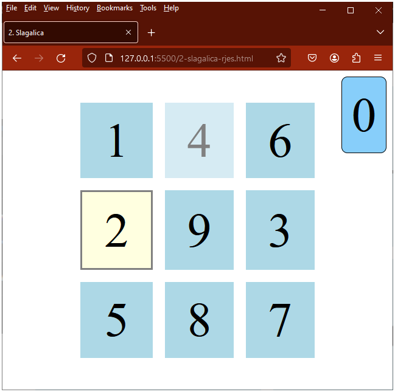

### 3.

Two input files (first.json and second.json) containing JSON fields of integers are given. An example of data organization in the specified files is:
```
[ 6, 2, 3, 1, 4, 5 ]
```

Write an asynchronous getMax() function that finds the largest number in the specified two files.

The function should:

- In parallel, for each file, load the values and find the largest number; and
- determine and return the greater of those two numbers.

When calling the getMax() function, it is necessary to ensure the handling of errors that may occur during its execution (e.g. the file does not exist or the data format is incorrect). Call the getMax() function and:

- if an error occurred, print "An error occurred" and then the error itself
- otherwise - print the largest number

Notes:

- Examples of files first.json and second.json can be found attached to this assignment
- Use fetch to load files
- For parallel execution, it is suggested to use Promise.all()
- The HTML file does not need to be written
- The specified input fields are examples, the function must also work for fields of different values

---

## ME 2022/2023

### 1.

The image below this assignment text shows a HTML page which has only one table. The table contains one image from this address: https://www.fer.unizg.hr/images/50029121/FER_logo_3.png.

To complete this task you need to submit HTML code which defines the appearance of the page, and also defines its minimal structure (required page elements). The width of the image (which is positioned in the middle table cell) needs to be 50 pixels. The cell border width is 1px. For all the page elements which you need to define and which are not specified as part of this assignment, freely choose any value. The size of the table is not important in this task (do not spend time matching the exact size of the table in the figure), while the structure of the table is!

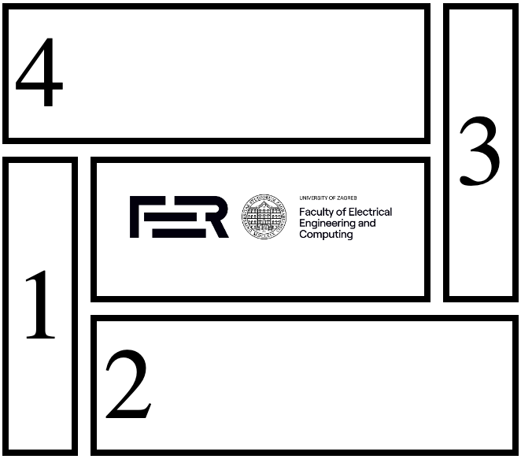

### 2.

A HTML page with CSS expressions is shown below (both in header and inline, in comment marked with S1-S7 and IS1). Determine which CSS expressions will be applied to the list elements.

The solution needs to be provided into the text field in this format: for every element of the list selectors (S1-S7 i IS1) which selects that element ordered by priority in a descending format, starting from the "winner":

```
1: S1, S2, S3, S4
2: IS1, S5, S6
3: S7, S2
```

The explanation:

- first list element is selected by selectors S1, S2, S3 and S4, where S1 is the top priority, then S2, etc. Since S1 is the top priority, first list element will be of 'blue' color
- second element - selectors IS1, S5, S6, where IS1 is the top priority and the element will be of green color.
- third element - selectors S7 and S2 where S7 is greater priority compared to S2 and the element will be of black color.

Notes:

- take care not to make typos while typing, it is best to copy/paste the format given above and just modify the selectors
- take care of both commas and semi-colons because this is an autmatically graded assignment
- Do not enter anything else into the text field.

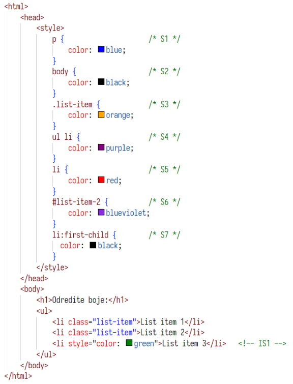

### 3.

Two input files are given (first.json and second.json) which contain JSON arrays of integers:

Input file with the first array first.json:
```
[ 1, 2, 3, 4, 5, 6]
```
Input file with the second array second.json:
```
[ 5, 6, 7, 8, 9]
```
Write a function which loads the contents of the previously stated files and find their overlap. The function needs to be asynchronous and needs to return a promise. Also, call the function and display its result to the console (for previously stated files first.json and second.json "[5, 6]" needs to be written to the console.

Notes:

Do not process errors, it is not needed in the solution
For loading files use fetch
Do not write HTML
The stated files are just examples, function should work with other arrays/files

### 4.

An initial HTML file css-4.html is given (please download the attachment) which needs to be modified so that it becomes responsive with the following characteristics (after you read the assignment text, please check the attached video CSS-4-demo.mp4):

- at resolutions greater or equal than 768px:
  - width of cards is: 400px
  - if they cannot fit into one row, they are pushed into the following row (their width is not reduced)
- at resolutions lower than 768px:
  - width of cards is 90% of the window and they are positioned one on top of another
  - a navigation bar appears on top and and can be used to "jump" directly to a particular card
  - in lower right corner of the screen a "button" exists which can be used to return to the top of the document

Please note:

- Cards have round corners and centered contents
- Cards should be spaced one from another
 -"button" for returning to the top could be formatted as you wish, but it always needs to be in the lower right corner

Complete the task by supplying one HTML file into which you need to place the CSS.
Submit the contents (copy/paste) of the file into the text box.

Help:

- an element can be hidden using display: none;

### 5.

Create a web page (HTML, CSS and JS files) which displays a window for accepting/rejecting cookies in the bottom right corner of the page. The image shows a page without contents, of blue background and with the cookies window in the bottom right corner.

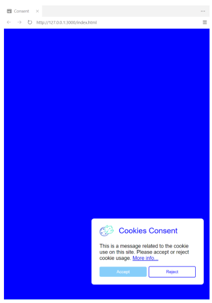

The cookies accept/reject window is composed of the following parts:

- Header with an icon (small image) and the "Cookies Consent" text
- Middle part with the text as in the image and with a "More info..." link with no destination set (please use href=#)
- Footer in which the Accept and Reject buttons are present (as in the image)

After Accept or Reject is clicked, the accept/reject cookie window becomes invisible, and information on the selection of one of the options (Accept or Reject) is stored in the local storage. Once the page is reopen (in the same web browser), the accept/reject cookie window is not shown, since the choice is already stored in the local storage.

IMPORTANT: If the accept/reject window is shown, it retains its fix position in the lower right corner of the page display (viewport), independent of the browser scrolling or changing the page size.

The accept/reject windows is shown in three cases. First, when mouse cursor is neither on top of the Accept button nor on top of the Reject button:

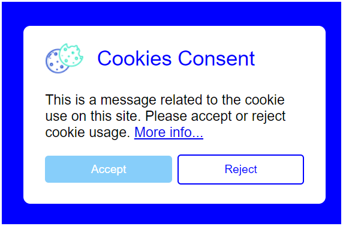

Second, when mouse cursor is on top of Accept:

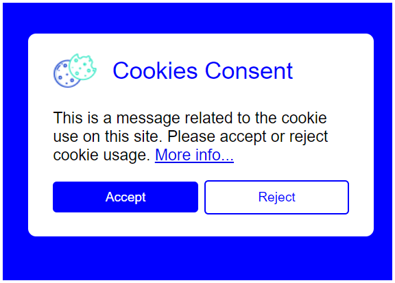

Third, when mouse cursor is on top of Reject:

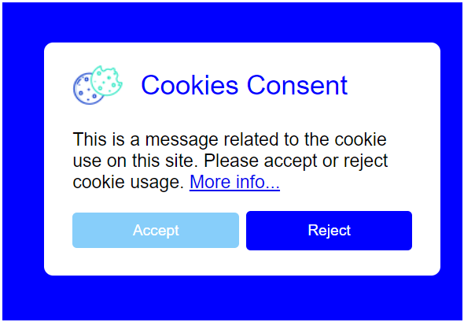

Notes:

- accept/reject window: width is 350px, distance from bottom 50px, distance from right 20px
- set font size to 24px for title "Cookies Consent", and 16px for middle text and link
- the used colors are: white, blue, lightskyblue
- cookies icon can be taken from here: Image\cookie.png-47274
- all other parameters/elements of the page set on your own to best match the images
- choose the name of the local storage field on your own
- buttons can be either button elements or divs, choose on your own

Complete the assignment by providing three files: one HTML, CSS and JS file. ZIP the files into one zip archive and submit it to the system (upload it).

---

## ME 2021/2022

### 1.

Image below shows a HTML page which is comprised of only one table. The table contains an image which can be found at this address: https://www.fer.unizg.hr/images/50029121/FER_logo_3.png. As part of the solution to this task, create a HTML page with the main HTML tags and the table. Image width needs to be set to 200 pixels. All other parameters which are not specified in this task can be set to any desired value.

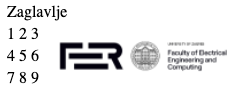

### 2.

Image below shows a HTML page with CSS espressions which, amongst other, target elements of an ordered list. Determine in which order these expressions will be applied to the to the second element of the list. The solution needs to be stated so that the colors are listed in the text field. Separate colors by semicolons and put selectors that "win" as first in the list. For example:
```
blue;green;gray;orange;red;yellow;
```
Explanation:

- second element is of color blue
- If there is no previous selector, it would be green,
- If there is no previous selector, it would be grey,
- If there is no previous selector, it would be orange,
- If there is no previous selector, it would be red,
- If there is no previous selector, it would be yellow.

Recommendation: be careful no to make typos when typing in the color names. Copy the example solution above and just reorder the colors instead of typing them on your own. Include ; because this task is evaluated automatically. Do not type other text in the text field.

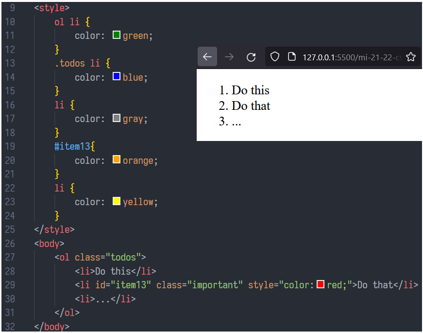

### 3.

The two sets of input data are given: categories and products. Write JavaScript code which determines which category has the most products and displays that information to the user (on the console).

Categories are given in the categories.json JSON file:
```json
[
    {"CategoryId": 1, "CategoryName": "IT Equipment"},
    {"CategoryId": 2, "CategoryName": "Drinks"},
    {"CategoryId": 3, "CategoryName": "Food"}
]
```
Note: attributes of each category are: category identifier and category title.

Products are given in the products.json JSON file:
```json
[
    {"ProductName": "USB-C charger", "CategoryId": 1, "NumProd": 55},
    {"ProductName": "Monitor MT246", "CategoryId": 1, "NumProd": 22},
    {"ProductName": "Mineral water", "CategoryId": 2, "NumProd": 250}
]
```
Note: attributes of each product are: product title, category identifier to which the product belongs to and the quantity of the product in the category.

In case of the stated files, note that the "Drinks" category has 250 products, which makes it the category with most products. The program in this case prints the following text on the console:
```
Category with most products: Drinks - 250
```
When writing your program use the already existing function LoadData(fileName) which loads a JSON file and as a result returns a promise with the file contents in JSON format.
```js
//already exists - just use it
async function LoadData(fileName){
  let promise = await fetch(fileName);
  if (!promise.ok) { throw new Error("Cannot load json file"); }
  else { return await promise.json();}     
}
```
Notes:

- in order to load categories.json and products.json files, use the LoadData() function. Own fetch calls are not permitted.
- in case of an error, stop the program execution, and process all errors in the main catch block, and display this message on the console: "An error has occured and program stopped working".
- for each categories with no products set NumProd to 0
- in case products contain identifiers of an unknown category, ignore such products and do not include them into results

### 4.

Make a responsive web app header as shown in the image below. At resolutions lower than 500px show initials instead of names, and instead of Link1-3 show one link (which represents a dropdown menu that does not have to be implemented). Links Link1-3 need to be implemented using the unordered list and li elements (Links... no need, it is just a regular link). Name (and initials) need to replaced with own name or initials. Heading font size is 1.5 times larger than the root document font size.

Notes:

- Heading needs to have rounded edge of green color (green) and contents set apart from the edge
  - estimate and set the concrete values in pixels
- Name/initals and links are
  - positioned on two different header sides (all the way left and right)
  - aligned vertically in a proper way
- There is horizontal space between Link1 - Link3
- When there is mouse over Link1-Link3 the background is set to the aqua color
  - Links... do no have an effect

Complete the task with one HTML file which also contains CSS. Submit the contents (c/p) of that file in the text field.

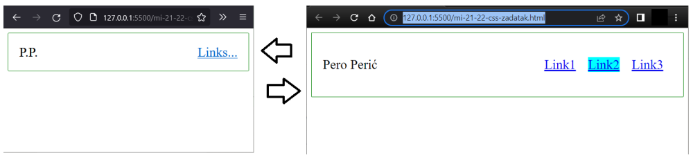

Help:

- element can be hidden with display:none;

### 5.

Create a web page (HTML, CSS and JS files) for leaving user feedback using a form. The feedback is comprised of a user's name, e-mail address and the message text, all typed in by the user. Page appearance is given in this image:

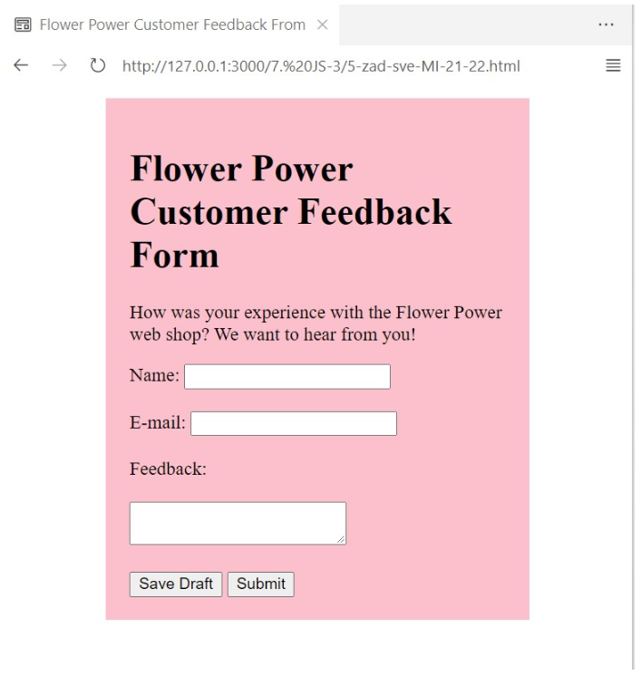

In addition to the Submit button, there is a Save Draft button which saves the feedback draft locally for later submission. After Save Draft is clicked, the draft is stored into the local storage, and automatically loaded when page is open again. Important: when Submit is clicked, the contents of all three fields needs to be vlaidated. If the fields are not set and e-mail field does not contain text in the x@y format (where x and y represent strings at least 1 character long), validation messages need to be shown to the user.

Notes:

- choose sizes of text fields on your own to best reproduce what is given in the photo
- method, target, action etc. attributes can be set to any values
- local storage attribute names can be set to any values
- pink rectangle has the color pink, and is set 15 viewport units apart from the left and the right edge of the page; padding of the pink rectangle is set to 20px

Complete the task with three files: one HTML, CSS and JS file. Zip the files and upload the zip as your solution.
