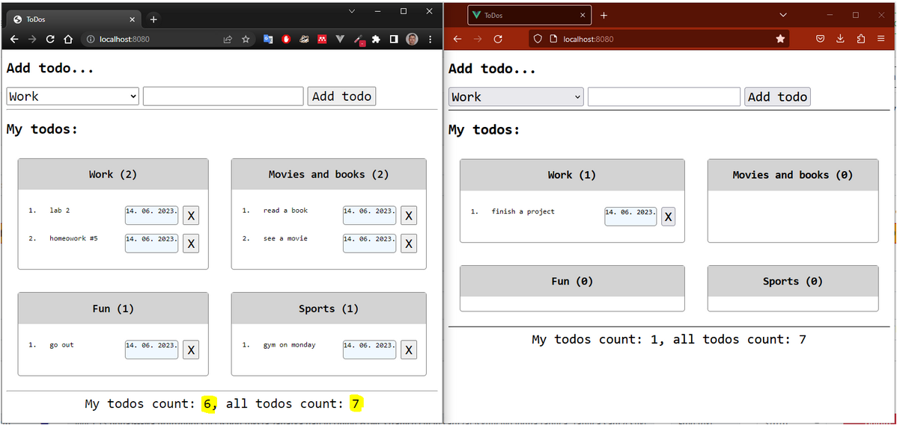

# Final Exam 2022/2023 programming task

It is necessary to create a web application that will allow personalized entry of reminders (ToDos) in four different
categories (`['Work', 'Movies and books', 'Fun', 'Sports']`). A reminder (todo item) consists of a description and an
automatically assigned date when it was entered (not entered by the user).

Create a single page that will enable:

- Input of reminders (selecting a category and description)
- Deletion of reminders
- Display of reminders by categories
- Display of the number of personal reminders and the total number of reminders (for all users)

For simplicity, there is no need to implement user login/registration. Instead, the reminders should be "personalized"
at the session level. This means that different (anonymous) users will see different reminders, and the reminders should
be tracked and managed at the user session level (similar to a shopping cart in an online store before the user logs
in).

The image below shows two different sessions where one user has 6 reminders and the other has 1, resulting in a total of
7 reminders (highlighted in yellow in the left image).

Regarding the graphical interface, the following should be implemented:

- Use a `monospaced` font.
- Additionally, in the header controls (category, description, button), the font should be 50% larger than the base font
  size of the document.
- Responsiveness: When the resolution is at least `768px`, display the cards in two columns; otherwise, display them in
  one column.
- Category cards:
    - Have a rounded border with a radius of 5px and should not touch each other (determine the spacing).
    - The title (including the number of reminders in that category) should be centered and have a background color of
      `lightgray`.
    - The reminders should be numbered and consist of:
        - Description (aligned along the left edge) and
        - Date (with a border and a background color of `aliceblue`) and a delete button (aligned along the right edge).
        - Hint: You can format the date using `Date.prototype.toLocaleDateString()`.
- The footer should be centered, and the font should also be 50% larger than the base font size of the document.

It is possible to enter multiple identical reminders (with the same description in the same category), but they should
be distinguishable (e.g., when deleting).

Please refer to the `zi-demo.mp4` video, which demonstrates the described functionalities (attached).

Technical Notes:

- Since you are on a limited network, the project skeleton containing installed `express`, `express-session`, and `ejs`
  is provided in the attachments (`helloworld.zip`).
- The project structure is not specified (e.g., whether you will have a routes directory or not, etc.).
- The structure of URLs is not specified; you can do it in the same way as shown in the demo or choose another approach.
- The application must listen on port 8080 and should be able to run with `node server.js`.

Task Submission:

1. Write a comment in the text field describing what has been done or not done regarding the requirements.
2. Attach a zip file of the project WITHOUT the `node_modules` directory. - PAY ATTENTION during the submission process
   to ensure
